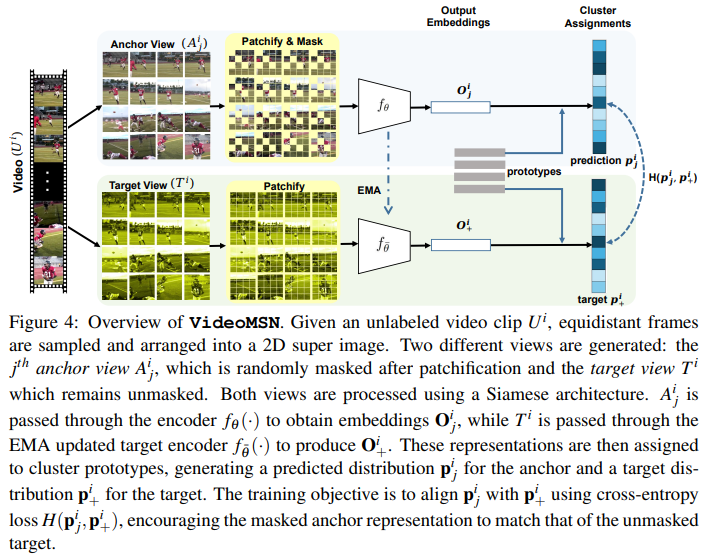

# Image Classifiers are Efficient Self-Supervised Video Representation Learners
This repository contains a PyTorch implementation of **VideoMSN(DINO) Pretraining** and **VideoMSN(DINO) Supervised Fine-tuning** on video datasets using super-image inputs.




For details please see the work, [Image Classifiers are Efficient Self-Supervised Video Representation Learners](https://openreview.net/pdf?id=qhkFX-HLuHV) by Owais Iqbal, Sudipta Sarkar, Shyam Marjit, Omprakash Chakraborty, Anirban Chakraborty, Abir Das.

## VideoMSN(DINO)
**VideoMSN** codebase for **VideoMSN Pretraining** and **VideoMSN Supervised Finetuning** on video datasets (Kinetics-400, SSv2, UCF 101, HMDB51 etc.) using super-image inputs.

This repository serves as the main hub containing:
- **[VideoMSN_Pretraining](VideoMSN_Pretraining)** → MSN-style (Masked Siamese Networks) pretraining of DINO (small & base)
- **[VideoMSN_Finetune](VideoMSN_Finetune)**    → Supervised finetuning of DINO (using VideoMSN-pretrained checkpoints) for video classification


## Repository Structure
```
VideoMSN/
├── VideoMSN_Pretraining/     # MSN-style self-supervised pretraining code
│   ├── main.py
│   ├── env.yaml
│   ├── README.md             # Detailed pretraining instructions
│   └── ...
├── VideoMSN_Finetune/        # Supervised finetuning code
│   ├── main.py
│   ├── README.md             # Detailed finetuning instructions
│   └── ...
├── README.md                 # This file (overview)

```

## Quick Start

1. **Clone the repo**
   ```bash
   git clone https://github.com/Rik-Sarkar-07/VideoMSN.git
   cd VideoMSN
   ```

2. **Environment Setup** (same for both pretraining & finetuning)
   ```bash
   conda env create --file VideoMSN_Pretraining/env.yaml
   conda activate sifar_msn
   ```

3. **Dataset Preparation**
   Please refer to https://github.com/IBM/action-recognition-pytorch for how to prepare action recognition benchmark datasets such as Kinetics400 and Something-to-Something. For Kinetics400, we used the urls provided at [this link](https://github.com/youngwanLEE/VoV3D/blob/main/DATA.md#kinetics-400) to download the data.

   - Prepare folder with `train.txt` and `val.txt` in **SIFAR format**:-
     ```
     /path/to/playing_drums/GJJUUAxgIYo_000007_000017.mp4 1 300 230
     ```
     → `video_path`  `start_frame`  `end_frame`  `label`
   - Pass the **folder path containing these txt files** to `--data_dir`

---
## VideoMSN Pretrained Checkpoint 

| Dataset | Model | Variant | Checkpoint Link (Download) |
|---|---|---|---|
| Kinetics-400 | VideoMSN | DINO-Base | [Link](https://drive.google.com/file/d/1zDWOktVvHAJcWJgyqA3ccYxIq9XIIrDs/view?usp=drive_link) |
| Kinetics-400 | VideoMSN | DINO-Small | [Link]() |
| Something-Something V2 (SSv2) | VideoMSN | DINO-Base | [Link](https://drive.google.com/file/d/10gM5Ic4lN9GtXoRLEBjF8Y-zGsPfUvjK/view?usp=drive_link)|
| Something-Something V2 (SSv2) | VideoMSN | DINO-Small | [Link](https://drive.google.com/file/d/17i6BI9GABWDbeeQwnFSfKHrSeVkQdVj0/view?usp=drive_link) |

## Acknowledgements

Thanks to the authors and contributors of **DINOv3**, **MSN**, and **SIFAR** for their valuable work and open-source contributions.

This project is built upon **[DINOv3](https://github.com/facebookresearch/dinov3)**, **[MSN](https://github.com/facebookresearch/msn)**, and **[SIFAR](https://github.com/IBM/sifar-pytorch)**. Thanks to the contributors of these great codebases.


## Citation (Will be Updated**)
<!--
```
@INPROCEEDINGS{iqb-bmvc2026,
  title={Image Classifiers are Efficient Self-Supervised Video Representation Learners},
  author={Owais Iqbal, Sudipta Sarkar, Shyam Marjit, Omprakash Chakraborty, Anirban Chakraborty, Abir Das},
  booktitle={The 37th British Machine Vision Conference (BMVC 2026)},
  year={2026}
}
```
-->
## License

This repository is released under the appache-2.0. license as found in the [LICENSE](LICENSE) file.


